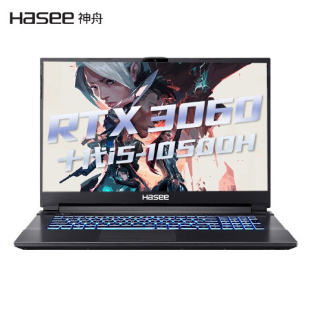
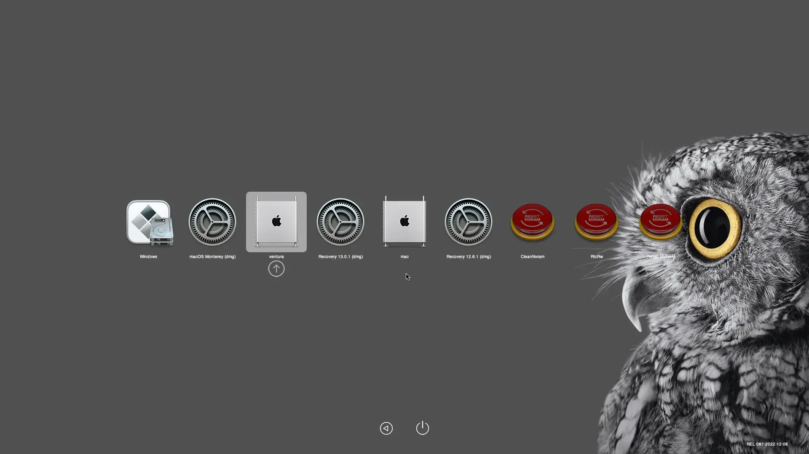

# OpenCore for hasee g8-ca5ns

## 简介

|       Key        |               Value                |
| :--------------: | :--------------------------------: |
| OpenCore version |               0.8.8                |
|  MacOS version   |          13.0.1 (22A400)           |
|   机型开箱参考   | https://post.smzdm.com/p/ax0q7vld/ |

黑苹果新手，契机是手上闲置有一台神舟的 K650D-G4D1 机器，买了有几年了，想出手结果发现价格异常的低（电子产品是真不保值）。就想着能不能试试黑苹果，同时手上有另外一台神舟的笔记本，也就是目前这一台。自己配置了一个 efi 尝试装系统发现各种问题，阴差阳错，经过淘宝各方收集和调试就有了这个项目。当然我会尝试带着现有的知识去配置一个 K650D-G4D1 的 efi 如果可用我会分享出来。

方便大家的同时也希望存在的问题能够得到解决，如果你认为可以解决残留的问题请务必联系我！

开机界面示例：

## 安装说明

- 记得换三码，里面自带的序列号是随机的
- 不要换机型，否则 usb 接口无法使用，需要替换 USBPorts.kext 内 plist 的机型值，你会写代码的话很简单打开改下两个地方就行
- 网卡驱动是安装 Ventura 用的，你安装其他版本的驱动需要替换成相应的版本
- 里面的配置会有点乱，是因为现在的配置文件是杂交的差不多完美了我会清除不要的配置
- 已经用来写了几天的代码，没啥问题。能开发，这个项目也是在 mac 下系统下传上来的

## 硬件

|   Key    |                                                              Value                                                              | Other                                                            |
| :------: | :-----------------------------------------------------------------------------------------------------------------------------: | ---------------------------------------------------------------- |
|   CPU    |                                            Intel(R) Core(TM) i5-10500H CPU @ 2.50GHz                                            | 6 核 12 线程，主频 2.5GHz 睿频 4.5GHz                            |
| 主板型号 |                                                           NH5x_7xDPx                                                            |                                                                  |
|   显卡   |                                                     Intel UHD Graphics 630                                                      |                                                                  |
|  显卡 2  |                                                       英伟达 RTX3060 6GB                                                        | 黑苹果已经屏蔽                                                   |
|   内存   |                                                 Samsung DDR4 2933 MHz 16 GB X 2                                                 | 总共 32GB                                                        |
| 无线网卡 |                                                          Wi-Fi 6 AX200                                                          |                                                                  |
| 有线网卡 |                                    RTL8111/8168/8411 PCI Express Gigabit Ethernet Controller                                    |                                                                  |
|   声卡   |                                                         Realtek ALC293                                                          |                                                                  |
|  显示屏  |                                                                                                                                 | 17.3 寸，100%srgb，1080P 分辨率，300nit 最高亮度，刷新频率 144Hz |
|  触控板  |                                                                ~                                                                |                                                                  |
|   硬盘   |                                              SanDisk Ultra 3D NVMe PCI-Express                                              |                                                                  |
|   接口   | USB3.0 X2 USB2.0 X1 HDMI X1 RJ45 网口 X1 MiniDP X1 SD 卡槽 X1 电源 X1 Type-C X1 耳机耳麦口各 X1 |                                                                  |

## 正常工作

- CPU 正常睿频
- 核显正常驱动，支持缩放/调节亮度/夜览
- USB 接口完成定制，支持 USB3.0 Type-C

## 存在的问题

- 声卡驱动不完美，声卡型号在支持的列表内，但是尝试更换了布局 id，都存在只能同时驱动一个的问题，也就是自带的麦克风和扬声器同时只有一个能工作。暂时不知道怎么解决

  个人看法：这个是厄待解决的一个问题，如果作为生产力，有时候会议的时候需要用到，目前只能蓝牙耳机解决

- 电池无法显示通电和断电状态

  个人看法：这个强迫症很难受，虽然是一直插着电使用的，但是看不到电源链接，有些软件会弹出请链接电源使用的提示，这个就很烦，不过还没遇到被阻断的问题

- 触摸板下面左右按键无法使用，好像可以换成其他驱动能使用但是无手势，目前是支持手势的，如果没有鼠标类似滑动的验证码无法拖动

  个人看法：这个也比较难受，不过好像可以定制 SSDT 解决下。比较高级，随缘有空研究。

- 无法睡眠(未测试)，但是锁屏后屏幕自动熄屏后无法唤醒，需要重启。

  个人看法：我不用睡眠这个功能。使用了 Caffeinated 这个软件防止电脑进入睡眠，不用的时候基本关机。对从 RAM 或者 硬盘中恢复的程序总感觉不干净会出问题。

- 无法使用博通网卡支持的隔空投送和随航（是这个吧）之类的功能

  个人看法：不需要这里功能

## Bios   设置

- 硬盘模式改 AHCI
- 其他的自己摸索下，好像就改了这个，这个机型的 bios 配置很少，网上有 vbios 可以刷，没试过

## 参考

- [Clevo-NH50-NH70-Hackintosh](https://github.com/MichaelPan1026/Clevo-NH50-NH70-Hackintosh)
